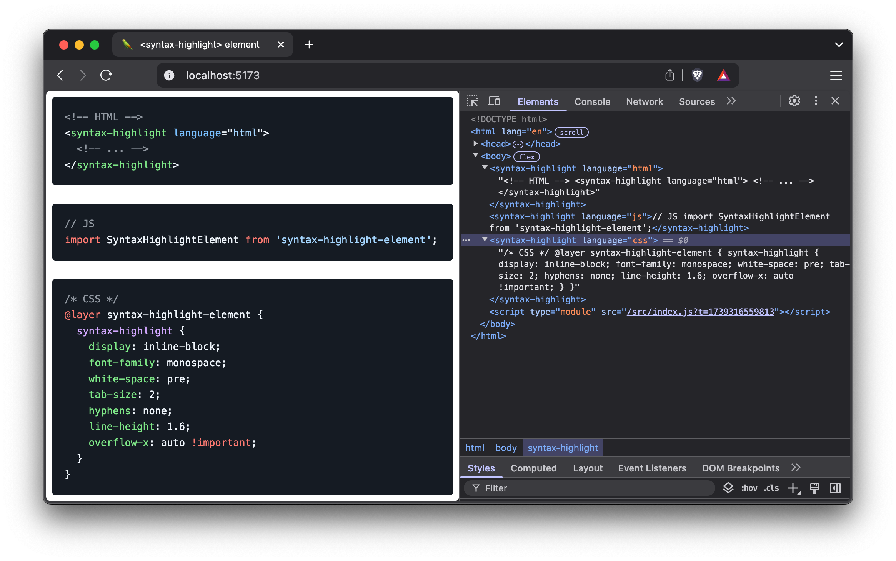

# &lt;syntax-highlight&gt; element

> Syntax Highlighting using the CSS Custom Highlight API.

The code is highlighted without having to wrap a bunch of `<span>` elements around each token, thanks to [Prism's][prism_github] tokenizer and the [CSS Custom Highlight API][MDN_CSS_Custom_Highlight_API].

<div align="center">
  <br>
  <br>
   element demo in the browser with DevTools open">
  <br>
  <br>
</div>

## Install

```shell
npm install syntax-highlight-element
```

## Usage

Make sure to load the default theme styles exported via `syntax-highlight-element/themes/default.css`.

```js
import 'syntax-highlight-element';
```

Or via CDN

```html
<link rel="stylesheet" href="https://unpkg.com/syntax-highlight-element@latest/dist/syntax-highlight-element.css">
<script type="module" src="https://unpkg.com/syntax-highlight-element@latest/dist/syntax-highlight-element.js"></script>
```

HTML

```html
<syntax-highlight language="js">
  // ... 
</syntax-highlight>
```

### Attributes

* `language` The code language. The default is `plaintext`. Currently suported languages `html|js|css`.

## Credits

Credits to [@bramus][bramus_github] and his [blog post][bramus_blog_post] where I first read about using the [CSS Custom Highlight API][MDN_CSS_Custom_Highlight_API] for syntax highlighting.

## License

MIT © [André Ruffert](https://andreruffert.com)

[prism_github]: https://github.com/PrismJS/prism
[bramus_github]: https://github.com/bramus
[bramus_blog_post]: https://www.bram.us/2024/02/18/custom-highlight-api-for-syntax-highlighting
[MDN_CSS_Custom_Highlight_API]: https://developer.mozilla.org/en-US/docs/Web/API/CSS_Custom_Highlight_API
