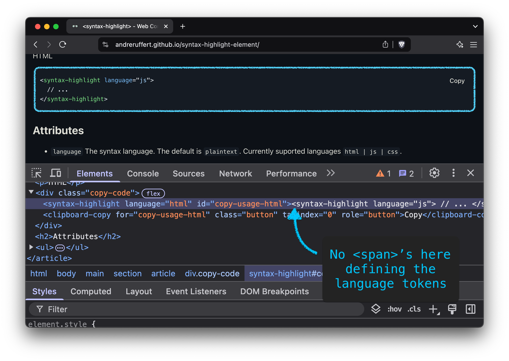

# &lt;syntax-highlight&gt; element

> Syntax Highlighting using the CSS Custom Highlight API.

[](https://github.com/andreruffert/syntax-highlight-element/actions/workflows/test.yml)
[](https://www.npmjs.com/package/syntax-highlight-element)
[](https://www.npmjs.com/package/syntax-highlight-element)

The code is highlighted without having to wrap a bunch of `<span>` elements around each token, thanks to [Prism][prism_github]'s tokenizer and the [CSS Custom Highlight API][MDN_CSS_Custom_Highlight_API].

<div align="center">
  <br>
  <br>
   element demo in the browser with DevTools open">
  <br>
  <br>
</div>

## Install

Install via npm

```shell
npm install syntax-highlight-element
```

## Usage

### JavaScript

Import as ES module

```js
import 'syntax-highlight-element';
```

Or via CDN

```html
<script type="module" src="https://unpkg.com/syntax-highlight-element@latest/dist/syntax-highlight-element.js"></script>
```

### HTML

```html
<syntax-highlight language="js">
  // ... 
</syntax-highlight>
```

### CSS

Make sure to load a theme e.g. `syntax-highlight-element/themes/prettylights.css`.

Or via CDN

```html
<link rel="stylesheet" href="https://unpkg.com/syntax-highlight-element@latest/dist/themes/prettylights.css">
```

Currently there are only limited [themes](https://github.com/andreruffert/syntax-highlight-element/tree/main/src/themes) available/converted. You can always create your own theme. Contributions are also very welcome.

## Attributes

* `language` The code language. The default is `plaintext`. Currently suported languages `html|css|js`.
* `content-selector` A CSS selector to specify the content element. The default is the element itself.

## Configuration
```js
/**
 * @typedef Config
 * @type {object}
 * @property {string[]} [languages=['markup', 'css', 'javascript']] - Language grammars to highlight.
 * @property {{ [key: string]: string[] }} languageTokens - Language specific token types.
 */
window.she = window.she || {};
/** @type {Config} */
window.she.config = {};
```

## Browser Support

<picture>
  <source media="(prefers-color-scheme: dark)" srcset="https://web-platform-dx.github.io/web-features/assets/img/baseline-limited-word-dark.svg">
  
</picture>

- [CSS Custom Highlight API][caniuse_mdn-api_highlight]

## Credits

* [Bramus Van Damme][bramus_github] and his [blog post][bramus_blog_post] where I first read about using the [CSS Custom Highlight API][MDN_CSS_Custom_Highlight_API] for syntax highlighting.
* [Prism][prism_github]'s tokenizer.

## License

Distributed under the MIT license. See LICENSE for details. 

© [André Ruffert](https://andreruffert.com)

[prism_github]: https://github.com/PrismJS/prism
[bramus_github]: https://github.com/bramus
[bramus_blog_post]: https://www.bram.us/2024/02/18/custom-highlight-api-for-syntax-highlighting
[MDN_CSS_Custom_Highlight_API]: https://developer.mozilla.org/en-US/docs/Web/API/CSS_Custom_Highlight_API
[caniuse_mdn-api_highlight]: https://caniuse.com/mdn-api_highlight
